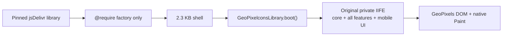
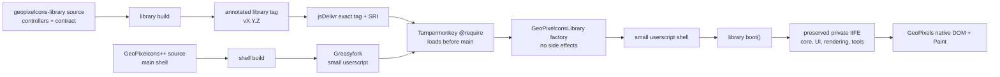
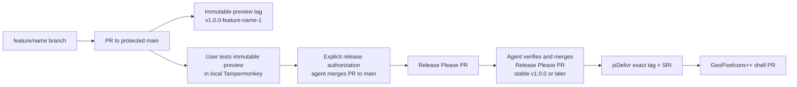

# GeoPixelcons Library Architecture

## Goal

Keep the Greasyfork-installed GeoPixelcons++ shell near 270-330 KB while
moving adapter-backed feature controllers into one immutable, readable library
bundle. The browser still downloads the complete feature set; this split reduces
the Greasyfork script artifact and makes large UI work independently testable.

## Current Compatibility Cut

The first complete migration uses a behavior-preserving boundary: the library
contains the original core, every feature module, footer, and mobile UI bundle
inside `GeoPixelconsLibrary.boot()`. The shell loads that side-effect-free
factory through `@require` and invokes it only after the document is ready.
This keeps `_settings`, `gppState`, and every existing lexical dependency in
one private IIFE, without `eval`, globals, or a risky all-at-once rewrite.

The shell is therefore currently about 2.3 KB. The 270-330 KB target remains a
safe ceiling for later shell capabilities, not a requirement to pad the shell.
Controller-level adapter extraction remains the next internal library phase.



## Repository Boundaries

Only two public code repositories are needed:

1. `geopixelcons-plusplus`: the thin Greasyfork shell, metadata, verified
   library pin, fallback, and release artifact workflow.
2. `geopixelcons-library`: all reusable feature controllers, the explicit
   adapter contract, library tests, and one readable published bundle.

Do not create separate contracts, CDN, mobile, or release repositories. Keep
contracts in this repository and test them from both repositories. A standalone
GeoPixelcons++ GitHub repository is optional later if its releases need an
independent public history; it is not needed to perform this split.

## Runtime Flow



The bundle must never fetch or evaluate more executable code at runtime. It
only registers `GeoPixelconsLibrary` during `@require`; the main script calls
it after private state is initialized. Private state such as `_settings` and
`gppState` must not be made global.

## Published Artifact

Build one artifact per release:

```text
dist/geopixelcons-library.js
```

Internally it may have `foundation`, `contracts`, and `features` source
directories, but use one `@require` line. Multiple independently loaded bundles
increase ordering, cache, rollback, and availability failure modes without
reducing runtime download for settings-gated features.

The main metadata must use an immutable tag and Tampermonkey SRI:

```text
// @require https://cdn.jsdelivr.net/gh/atharray/geopixelcons-library@vX.Y.Z/dist/geopixelcons-library.js#sha256-<base64-digest>
```

## Future Adapter Contract

The current compatibility wrapper does **not** use this adapter yet: keeping the
legacy IIFE whole is safer. Once a feature becomes a restartable controller,
the shell/library boundary will pass a frozen, versioned object with only the
operations it needs:

```js
{
  contractVersion: 1,
  env: { window, document },
  settings: { get(), subscribe(listener) },
  native: { clickControl(id), changeColor(hex), activateEyedropper() },
  ghost: { getTemplates(), focus(id), renderPreview(template), scan(template) },
  map: { readCenterGrid(), commitPosition(template, x, y), goTo(template) },
  ui: { requestRefresh(), reportError(error, context) }
}
```

Each controller returns an idempotent object with `refresh()` and `destroy()`.
Destroy restores every relocated node, attribute, style, listener, observer,
and focus destination. The shell must remain safe when the factory is missing,
throws, or returns an invalid controller.

## Migration Budget And Order

The current main source is 1,684,993 bytes. The header, core, mobile bridge,
and footer are 269,948 bytes, giving a 1,415,045-byte theoretical extraction
ceiling. The practical target is 270-330 KB after adapter growth.

1. Move the existing mobile presentation bundle first (182,134 bytes). It is
   already adapter-shaped; re-home it here without changing behavior.
2. Extract isolated UI controllers next: theme editor, map markers, region
   screenshot, and region highscore (about 239 KB combined).
3. Extract feature controllers with broader site contracts: guild overhaul,
   paint/brush swap, bulk purchase, ghost-template manager, palette search, and
   paint-menu controls (about 525 KB combined).
4. Extract Ghost++ only after its adapter is fully specified. Its engine is
   about 582 KB and is the highest-risk boundary because it owns indexed
   templates, renderer state, scan state, and native compatibility.

No phase may delete its main implementation until production-IIFE tests prove
the library-present, library-missing, initializer-throw, invalid-controller,
disable, and re-enable paths.

## Release Order

1. Build and test the library locally.
2. Commit, annotate, and—only with approval—push its tag.
3. Verify the tag on origin, jsDelivr HTTP 200 response, downloaded byte hash,
   and SRI digest.
4. Update the main header to that exact tag and digest, then build/test the
   thin shell.
5. Publish the main userscript only after both artifacts are verified.

Never point a Greasyfork release at a local tag, a branch, `latest`, or an
unhashed executable URL.

## Protected-Branch Release Cadence



Preview tags are created only for same-repository PRs and point to that PR's
head commit. They are immutable local-test candidates: the agent supplies the
exact SRI-pinned jsDelivr `@require` line, the user tests it in Tampermonkey,
and then explicitly authorizes release. They do not alter `main`, do not move a
stable tag, and must never be copied into a Greasyfork `@require`. After that
authorization, the agent merges through branch protection and Release Please
prepares the stable version from conventional `feat:` (minor) and `fix:`
(patch) commits. Greasyfork upload remains manual.
